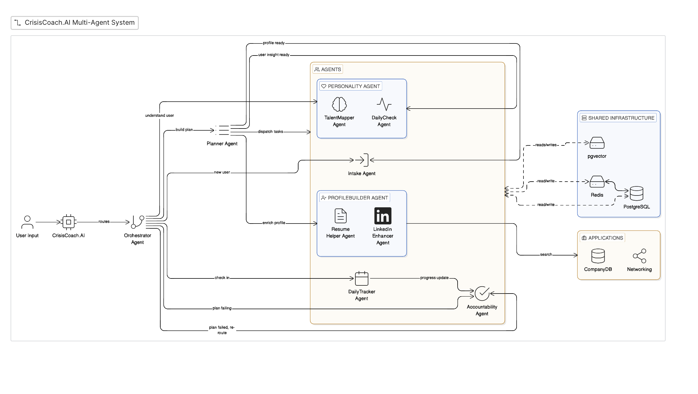

# CrisisCoach AI

An AI trainer that helps you reach your absolute best when crisis hits and logic takes a backseat. Layoffs hit hard. It feels personal. The internet has all the advice you need but when crisis hits, you are not mentally in the state to find it, read it, or act on it. That preparation gap is what separates people who break through from people who stay stuck. Not effort. Not talent. Preparation. CrisisCoach is an AI coach that customizes your preparation backed by data and your own existing potential so when logic takes a backseat, you still move forward.

Built with Next.js + FastAPI + Anthropic Claude, powered by a multi-agent system that meets you where you are emotionally and turns overwhelm into action.

## Multi-Agent Architecture



CrisisCoach.AI uses an **orchestrated multi-agent system** where each agent has a focused responsibility. Here's how a user's journey flows through the system:

### Flow Overview

```
User Input
    │
    ▼
CrisisCoach.AI  ──routes──►  Orchestrator Agent
                                     │
              ┌──────────────────────┼──────────────────────┐
              │                      │                       │
        new user?             returning user?          plan failing?
              │                      │                       │
              ▼                      ▼                       ▼
        Intake Agent          Planner Agent           Accountability
              │               (builds plan,            Agent (re-routes,
        collects initial      dispatches tasks)         triggers replanning)
        context                      │
                        ┌────────────┼───────────────┐
                        │            │               │
                        ▼            ▼               ▼
              Personality Agent  ProfileBuilder   DailyTracker
              ┌────────────────┐  Agent          Agent
              │TalentMapper    │  ┌────────────┐  (check-ins,
              │Agent           │  │Resume      │   progress
              │                │  │Helper      │   updates)
              │DailyCheck      │  │            │
              │Agent           │  │LinkedIn    │
              └────────────────┘  │Enhancer    │
                                  └────────────┘
```

### Agent Roles

| Agent | Role |
|-------|------|
| **Orchestrator Agent** | Entry point — routes every user message to the right agent based on context (new user, check-in, plan failure, etc.) |
| **Intake Agent** | Onboards new users — collects initial situation, emotional state, skills, and goals |
| **Planner Agent** | Builds a structured action plan from user context; dispatches tasks to specialized agents |
| **Personality Agent** | Houses the *TalentMapper Agent* (surfaces transferable skills) and *DailyCheck Agent* (monitors mood/energy daily) |
| **ProfileBuilder Agent** | Houses the *Resume Helper Agent* and *LinkedIn Enhancer Agent* — enriches the user's professional profile |
| **DailyTracker Agent** | Handles daily check-ins and sends progress updates back to the Accountability Agent |
| **Accountability Agent** | Monitors plan health — if progress stalls or the plan is failing, it signals the Orchestrator to re-route and replan |

### Shared Infrastructure

All agents read and write to a shared layer:

- **PostgreSQL** — persistent user profiles, plans, and history
- **Redis** — short-term session state and task queues
- **pgvector** — semantic memory for surfacing relevant past context
- **CompanyDB + Networking** — external search for job opportunities and connections

### Key Flow Paths

1. **New User** → Orchestrator → Intake Agent → Planner Agent → dispatches to Personality + ProfileBuilder agents → `profile ready` signal returned
2. **Returning User (check-in)** → Orchestrator → DailyTracker Agent → Accountability Agent → progress update
3. **Plan Failing** → Accountability Agent → Orchestrator → Planner Agent (replanning loop)
4. **Profile Enrichment** → Planner Agent → ProfileBuilder Agent (Resume Helper + LinkedIn Enhancer) → `user insight ready`

## Project Structure

```
crisiscoach-ai/
├── frontend/          # Next.js 14 (App Router, TypeScript, Tailwind)
│   └── src/
│       ├── app/           # Next.js app directory
│       ├── components/    # ChatWindow, ChatBubble
│       └── lib/           # API client
└── backend/           # FastAPI Python app
    └── app/
        ├── main.py        # FastAPI entry point
        ├── routers/       # chat.py — POST /api/chat
        ├── services/      # claude_client.py — Anthropic SDK calls
        └── models/        # Pydantic schemas
```

## Quick Start

### Backend

```bash
cd backend
python3 -m venv .venv && source .venv/bin/activate
pip install -r requirements.txt
cp .env.example .env          # add your ANTHROPIC_API_KEY
uvicorn app.main:app --reload
```

### Frontend

```bash
cd frontend
cp .env.local.example .env.local
npm install
npm run dev
```

Open [http://localhost:3000](http://localhost:3000).

## API

| Method | Path | Description |
|--------|------|-------------|
| GET | /health | Health check |
| POST | /api/chat | Send message history, receive Claude reply |

### POST /api/chat

```json
{
  "messages": [
    { "role": "user", "content": "I'm feeling overwhelmed." }
  ]
}
```
